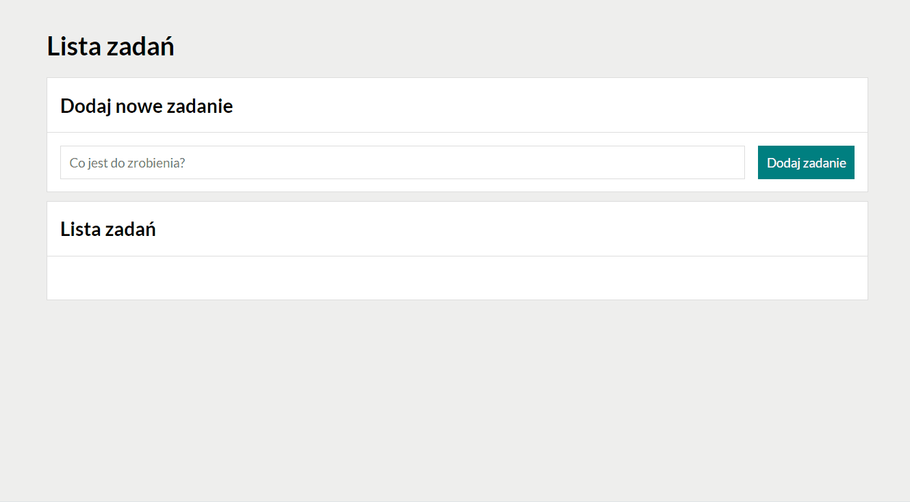

# To Do List

## Description:

This aplication was created as a part of [YouCode](https://youcode.pl) course. It's a simple To Do List, where you can add one or more tasks, check if the task is done and delete it.

## Used technologies:

- Semantic HTML;
- CSS;
- BEM methodology;
- ES6 features;
- Grid-based layout;
- An arrow functions.

## Demo version:

https://lenanag.github.io/to-do-list/
